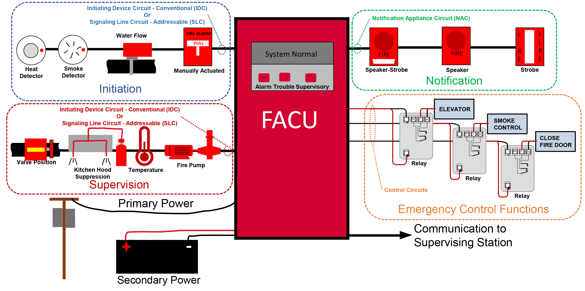
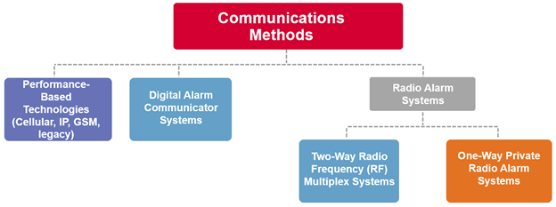
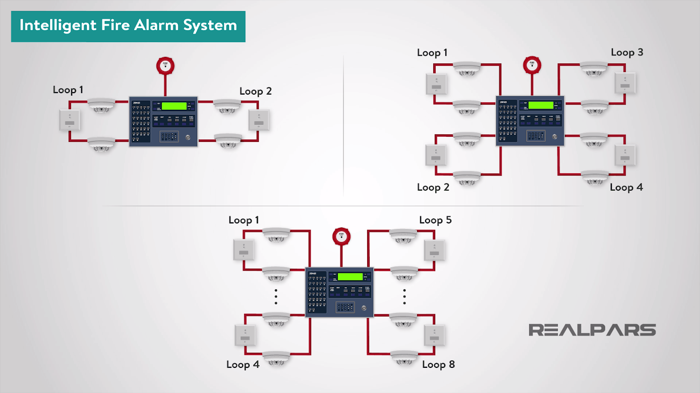

## Acronyms:
- FAS - Fire Alarm System
- FACU - Fire Alarm Control Unit
- FACP - Fire Alarm Control Panel

## Theory:
### Alarm
- An alarm condition means there is an immediate threat to life, property, or mission. 
- An example of this would be a smoke detector sending a signal to the fire alarm control unit that there is a presence of smoke, which would initiate notification to the occupants to evacuate.

### Trouble
- A trouble condition means there is an issue or fault with the fire alarm system. 
- An example would be a break in an initiating device circuit. This would show up as a trouble signal on the control unit.

### Supervisory
- A supervisory condition means there is an issue with a system, process, or equipment that is monitored by the fire alarm control unit.
-  An example of this would be a sprinkler system valve being closed, this would show up as a supervisory signal on the control unit.

### Types of Fire Alarm Detectors
- Heat detectors
- Smoke detectors 
	1. Ionization
	2. Light Scattering
	3. Light Obscuring)
- Carbon Monoxide detectors
- Multi-sensor detectors
- Manual Call Points

### Types of Fire Alarm Systems
- Conventional
- Addressable
- Intelligent
- Wireless

### Loops
- **2 Loop Configuration**
	- Involves the use of two separate loops connected to a loop controller
	- In case one loop experiences a fault or failure, the second loop can continue to operate, ensuring that the fire detection system remains functional
- **4 Loop Configuration**
	- This setup provides greater flexibility, allowing for the connection of a larger number of devices 
	- Ensuring that the system remains operational even if two loops fail simultaneously
- **Factors to Consider When Choosing Loop Configurations**
	1. Building Size
	2. Redundancy Requirements
	3. Scalability
	4. Budget Constraints

### Fire Alarm Control Panel
- The controlling component of a fire alarm system. 
- The panel receives information from devices designed to detect and report fires, monitors their operational integrity, and provides for automatic control of equipment, and transmission of information necessary to prepare the facility for fire based on a predetermined sequence.
- There are four basic types of panels: 
	1. coded panels
	2. conventional panels
	3. addressable panels
	4. multiplex systems

- Case Study: **Fire Class FC600 (FC602S / FC604S)**
	- Launched in **August 2021** in India as part of Johnson Controls’ Open Blue suite
	- **4.3‑inch color LCD screen** with **32 fire/fault zone LEDs**: improves visibility and intuitive operation
	- **Panel variants**:
		- **FC602S**: 2 standard loops (or 1 high‑power), supporting up to **250 addressable points**.
		- **FC604S**: 4 loops (or 2 high‑power loops), supporting up to **500 addressable points**
	- **Event Logging**: 10,000‑event log, with comprehensive point management & disable functions to streamline maintenance
	- **Aesthetics & User‑friendliness**: sleek, compact housing with customizable screensaver text
	- Operational Benefits
		- Minimizes operator error through clear visual display
		- Reduces maintenance via automatic battery tests, walk‑test functions, and detector health features
		- Designed for easy installation and low upkeep — ideal for commercial buildings and facilities management

## References:
- https://www.nfpa.org/news-blogs-and-articles/blogs/2021/03/03/a-guide-to-fire-alarm-basics
- https://www.realpars.com/blog/fire-alarm-system
- https://en.wikipedia.org/wiki/Fire_alarm_control_panel
- https://www.isrmag.com/johnson-controls-launches-fireclass-fc600-addressable-fire-control-panels-in-india/
- https://www.informedsystemsltd.com/understanding-loop-configurations-in-addressable-fire-panels/
