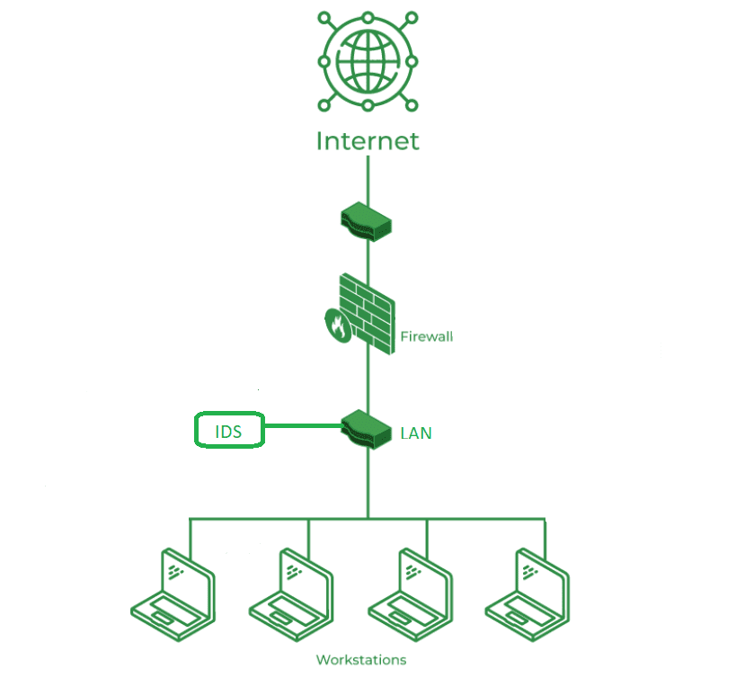

## Acronyms:
- IDS - Intrusion Detection System
- SIEM - Security Information and Event Management
- NIDS - Network Intrusion Detection System
- HIDS - Host Intrusion Detection System
- APIDS - Application Protocol-Based Intrusion Detection System
- PIDS - Protocol-Based Intrusion Detection System
## Theory:
### Introduction:
- Intrusion is when an attacker gets unauthorized access to a device, network, or system.
- Intrusion Detection System (IDS) observes network traffic for malicious transactions and sends immediate alerts when it is observed. 
- It is software that checks a network or system for malicious activities or policy violations. Each illegal activity or violation is often recorded either centrally using an SIEM system or notified to an administration.
### Common Methods of Intrusion
- Address Spoofing: Hiding the source of an attack by using fake or unsecured proxy servers making it hard to identify the attacker.
- Fragmentation: Sending data in small pieces to slip past detection systems.
- Pattern Evasion: Changing attack methods to avoid detection by IDS systems that look for specific patterns.
- Coordinated Attack: Using multiple attackers or ports to scan a network, confusing the IDS and making it hard to see what is happening.
- ### Classification of IDS:
- Network Intrusion Detection System (NIDS):
	- Monitors network traffic across an entire network segment to detect suspicious activity or known attack patterns. It analyzes packet data flowing to and from all connected devices.
- Host Intrusion Detection System (HIDS):
	- Runs on individual hosts (servers or workstations) and monitors system logs, file integrity, and local activity to detect unauthorized changes or malicious behavior.
- Hybrid Intrusion Detection System:
	- Combines both NIDS and HIDS capabilities to provide broader coverage, leveraging both network-level and host-level monitoring for more accurate detection.
- Application Protocol-Based Intrusion Detection System (APIDS):
	- Focuses on monitoring specific application-layer protocols (e.g., HTTP, SQL) to detect misuse or attacks targeting those applications.
- Protocol-Based Intrusion Detection System (PIDS):
	- Watches over specific protocols (often at lower layers, such as HTTP or FTP) at the protocol stack level, typically deployed in front of servers to monitor protocol compliance and anomalies.
- Signature-Based Detection:
	- Identifies intrusions by matching observed events against a database of known attack patterns or signatures; effective for known threats but cannot detect novel attacks.
### IDS vs Firewall:

| **Aspect**               | **Intrusion Detection System (IDS)**                                                 | **Firewall**                                                     |
| ------------------------ | ------------------------------------------------------------------------------------ | ---------------------------------------------------------------- |
| **Primary Function**     | Monitors and analyzes traffic to detect suspicious activity or attacks               | Controls and filters traffic entering or leaving a network       |
| **Action Taken**         | Mostly passive—alerts administrators but doesn’t block traffic automatically         | Active—blocks or allows traffic based on defined rules           |
| **Traffic Direction**    | Monitors inbound and outbound traffic                                                | Primarily controls inbound and outbound traffic                  |
| **Placement**            | Inside the network to watch internal and external traffic                            | At the network perimeter to act as a barrier                     |
| **Detection Capability** | Can detect internal attacks and policy violations                                    | Cannot detect attacks inside the network once traffic is allowed |
| **Signature Use**        | Often uses signatures and anomaly detection to identify threats                      | Relies on rule-based filtering (IP, port, protocol)              |
| **Response Time**        | Detects and alerts in real time but requires manual intervention (unless integrated) | Immediately blocks or allows traffic as per configured policies  |
| **Focus**                | Identifying malicious activity and policy breaches                                   | Enforcing access control policies                                |
| **Examples**             | Snort, Suricata, OSSEC                                                               | pfSense, Cisco ASA, iptables                                     |
### **Snort** _(by Cisco)_
- **Type:**  Open-source Network Intrusion Detection and Prevention System (NIDS/NIPS)
- **Key Specs & Features:**
	- **Detection Methods:** Signature-based, protocol analysis, anomaly detection
	- **Performance:** Can handle multi-gigabit traffic with proper hardware (e.g., >1 Gbps throughput)
	- **Signatures:** Over 13,000 community and subscriber rules for known attacks
- **Modes:**
    - Sniffer mode (packet logging)   
    - Packet logger mode (recording to disk)    
    - NIDS mode (detection and alerting)    
- **Deployment:** Linux, Windows, BSD systems
- **Integration:** Can be combined with tools like Snorby, BASE, or Security Onion for visualization and management
- **Output:** Alerts in unified logs, syslog, database logging
- **Use Case:**  
	- Deployed in enterprise networks to monitor traffic in real time, detect intrusions, and alert security teams.
## References:
- https://www.geeksforgeeks.org/intrusion-detection-system-ids/
- https://www.snort.org/
- https://en.wikipedia.org/wiki/Snort_(software)