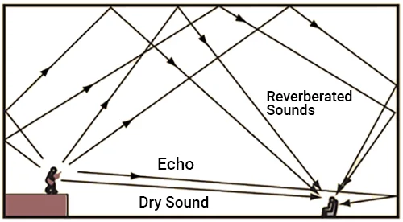
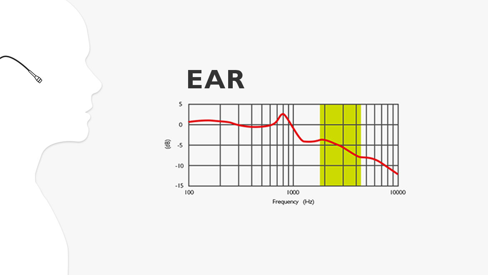
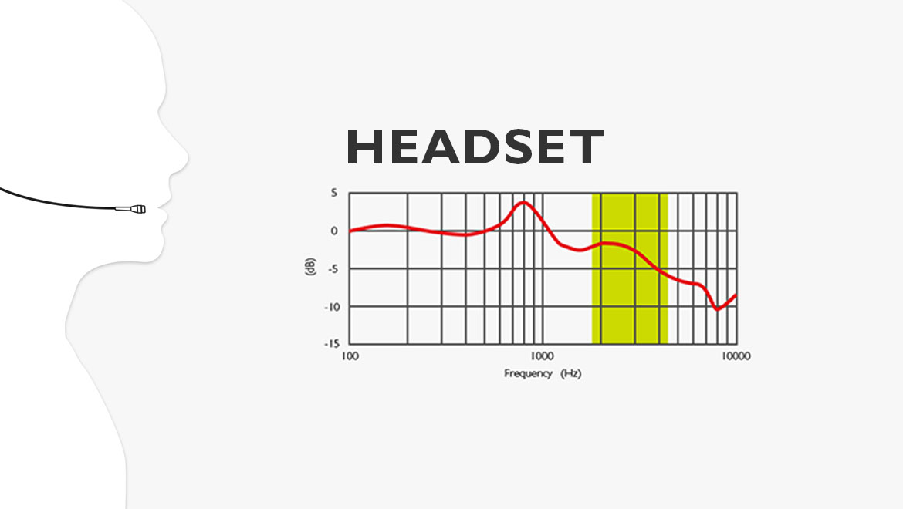
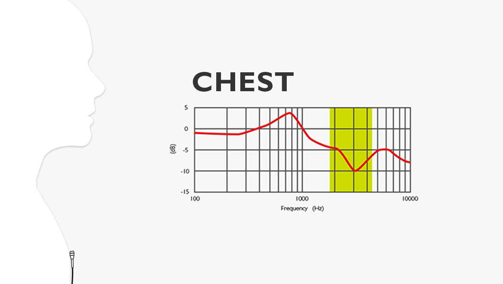

## Acronyms:
- PAS - Public Address System
- EASE - Enhanced Acoustic Simulator for Engineers
- STI - Speech Transmission Index
- DANTE - Digital Audio Network Through Ethernet
- NFPA - National Fire Protection Association
## Theory:
### introduction:
-  A **public address system** (or **PA system**) is an electronic system comprising microphones, amplifiers, loudspeakers, and related equipment. 
- It increases the apparent volume (loudness) of a human voice, musical instrument, or other acoustic sound source or recorded sound or music. PA systems are used in any public venue that requires that an announcer, performer, etc. be sufficiently audible at a distance or over a large area. 
- Typical applications include sports stadiums, public transportation vehicles and facilities, and live or recorded music venues and events.

### Acoustic Design and Sound Propagation Modeling:
- Acoustic design involves planning and implementing architectural elements and materials to manage sound reflection, absorption, and diffusion, while sound propagation modeling uses computer simulations to predict how sound waves behave in a space.
- speaker placement, room geometry, reverberation time, and materials affect intelligibility and coverage.
		- Simulation tools used to model SPL (Sound Pressure Level) distribution.
	1. EASE 
	2. Odeon
- STI (Speech Transmission Index)
	- The STI measures some physical characteristics of a transmission channel (a room, electro-acoustic equipment, telephone line, etc.), and expresses the ability of the channel to carry across the characteristics of a speech signal.
	- 	- C50 clarity index:
		- Compares the energy of early reflections (arriving within 50 milliseconds) to the energy of later reflections.
	- C50 quantifies the ratio of early to late arriving sound energy, while STI measures how well speech can be understood, taking into account factors like reverberation and background noise.

### Microphone Types, Placement, and Signal Chain:
- Dynamic and condenser microphones
	- Dynamic microphones are known for their durability and ability to handle high sound pressure levels, making them suitable for live performances and loud sound sources. 
	- Condenser microphones, on the other hand, are more sensitive and offer a wider frequency response, making them ideal for studio recording and capturing subtle details in vocals and instruments
	- Placement

|  |  |  |
| ------------------------------------ | ------------------------------------ | ------------------------------------ |
### Amplification Technologies and Power Management:

| **Class** | **Architecture**                             | **Efficiency** | **Use Case in PAS**                         | **Advantages**                             | **Disadvantages**                           |
| --------- | -------------------------------------------- | -------------- | ------------------------------------------- | ------------------------------------------ | ------------------------------------------- |
| **A**     | Output devices conduct 360° of waveform      | ~20–30%        | Rare in PAS (mostly hi-fi, not PA)          | Excellent linearity, low distortion        | Inefficient, generates heat                 |
| **B**     | Two devices conduct 180° each (push-pull)    | ~50–60%        | Medium PA applications                      | Better efficiency than Class A             | Crossover distortion possible               |
| **AB**    | Mix of Class A and B to reduce distortion    | ~50% typical   | Common in PAS amplifiers                    | Balanced efficiency and sound quality      | Still some heat and moderate efficiency     |
| **D**     | Pulse-width modulation (switching amplifier) | ~85–95%        | Large-scale PAS, touring, installed systems | Very high efficiency, compact, lightweight | Potential RF noise, requires good filtering |

### Integration with Emergency and Voice Evacuation Systems:

| **Standard**    | **Region / Body**     | **Scope**                                                                                 | **Key Requirements**                                                                                                                                                                |
| --------------- | --------------------- | ----------------------------------------------------------------------------------------- | ----------------------------------------------------------------------------------------------------------------------------------------------------------------------------------- |
| **EN 54-16**    | Europe (CEN)          | Voice alarm control and indicating equipment (VACIE) for fire detection and alarm systems | - Supervision of critical paths - Fault monitoring and indication within 100 sec - Automatic switching to emergency mode - Battery backup (≥24 hr standby + ≥30 min alarm) |
| **EN 54-4**     | Europe                | Power supply equipment for fire alarm and voice alarm systems                             | - Charger and battery supervision - Capacity for specified standby and alarm durations                                                                                           |
| **NFPA 72**     | USA (NFPA)            | National Fire Alarm and Signaling Code                                                    | - Prioritization of emergency messages - Intelligibility criteria (STI ≥ 0.5 recommended) - Automatic message initiation - Survivability requirements for cabling          |
| **ISO 7240-16** | International         | Voice alarm control and indicating equipment                                              | - Functional requirements similar to EN 54-16 - Environmental and electrical resilience                                                                                          |
| **BS 5839-8**   | UK (British Standard) | Design, installation, commissioning, and maintenance of voice alarm systems               | - System zoning and phased evacuation - Manual and automatic controls - Maintenance protocols                                                                                 |
### Digital Audio Transport Protocols:
- **Dante (Digital Audio Network Through Ethernet):**
	- Developed by Audinate, widely adopted in pro audio.      
	- Uses standard IP networks (Layer 3).
	- Supports hundreds of channels with ultra-low latency (<1 ms).
	- Plug-and-play device discovery and routing via Dante Controller.
        
- **AES67:**
	- Open interoperability standard for audio-over-IP.
	- Enables different networked audio systems (e.g., Dante, Ravenna, Q-LAN) to exchange streams.
	- Standardizes clock synchronization (PTPv2), audio encoding, and transport.
        
- **Advantages:**
	- Simplifies large-scale PAS cabling (single Cat5e/6 network).
	- Scalable distribution across buildings or campuses.
	- Centralized monitoring and control.

- **Considerations:**
	- Requires network QoS configuration to avoid jitter/dropouts.
	- Clock master selection critical for sync.
	- Redundancy planning (primary/secondary networks).
## References:
- https://en.wikipedia.org/wiki/Public_address_system
- https://en.wikipedia.org/wiki/Speech_transmission_index
- https://www.electronics-tutorials.ws/amplifier/amplifier-classes.html